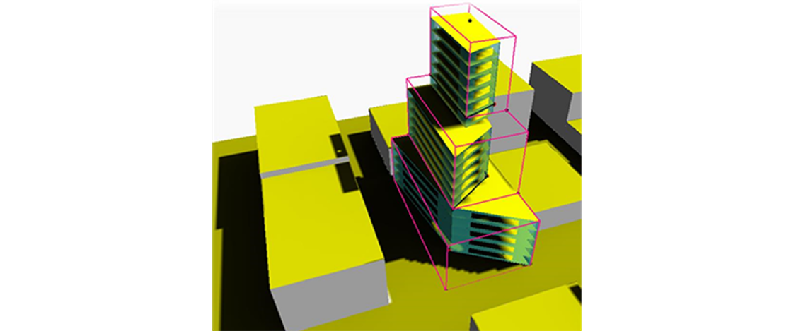
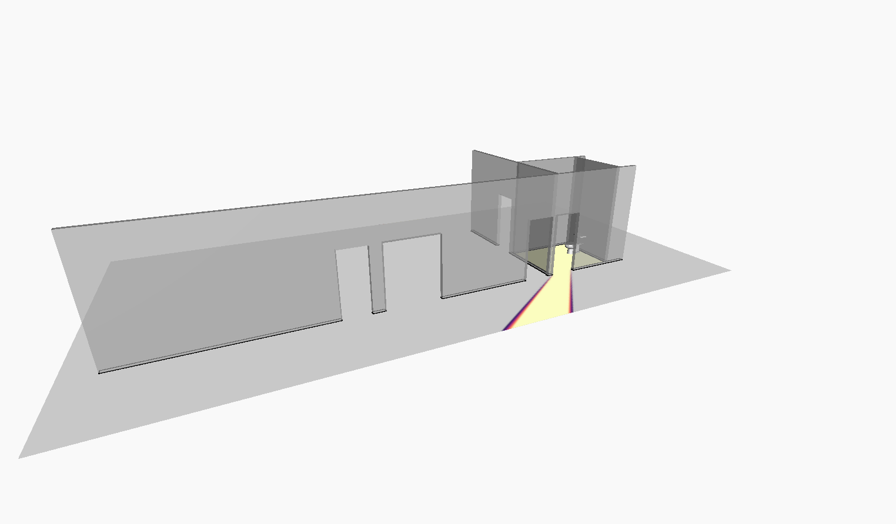

# List of Community Examples

## Architectural Workflows

### High Performance Building Design Based on Daylight Analysis

**Author**: Vina Rahimian

**Required Dynamo packages:** Ampersand, Solar Analysis for Dynamo, Refinery Toolkit for Massing, Refinery Toolkit for Space Planning.

**Description:** Use site context and a zoning boundary created in Revit to create a generative building form with maximum indoor daylight and PV potential analysis as the key focus.

[Download workflow files](https://github.com/DynamoDS/RefineryPrimer/releases/download/samples-v2/RAH_ThreeSolidTowerSolarAnalysis.zip).

  

---

### Sightline Analysis for Restrooms

**Author**: John Pierson

**Required Dynamo packages:** SpaceAnalysis, Clockwork, archilab

**Description:** The graph will evaluate the sight lines for a restroom given a water closet Revit element. This can be expanded upon to include multiple sight lines, generative placement of the element, etc. This sample's primary goal is to demonstrate how to use the Space Analysis package in a Revit context.

[Download workflow files](../../04-sample-workflows/04-06_community-examples/04-06-00_Example-files/PIE_RestroomSightlineAnalysis/PIE_RestroomSightlineAnalysis.zip).

  

---

## MEP Workflows

MEP workflows will be exhibited here.

---

## Structural Workflows

Structural workflows will be exhibited here.

---