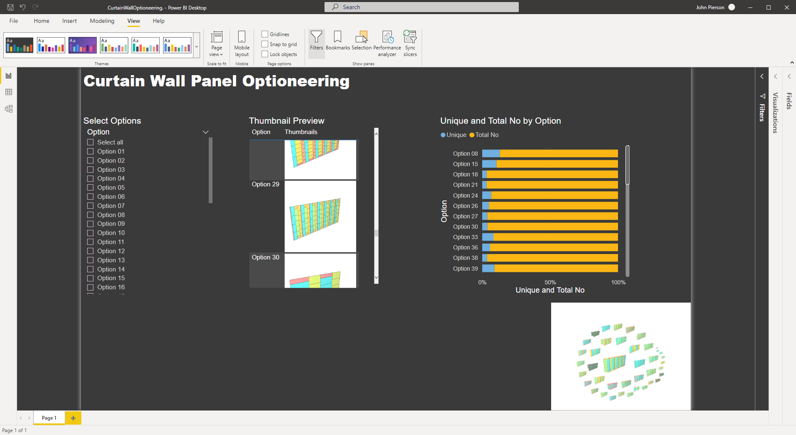
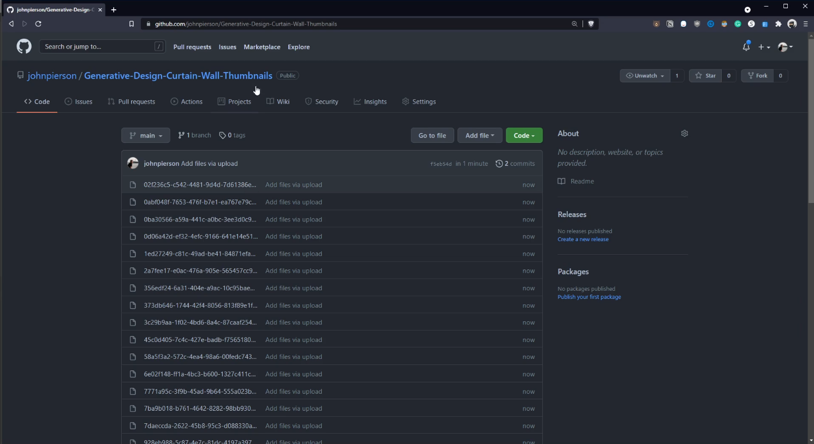
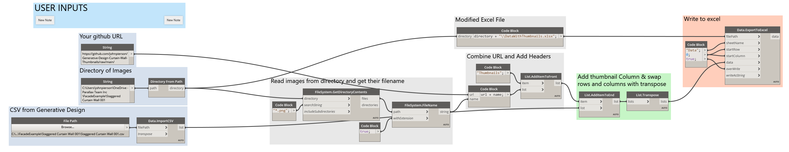
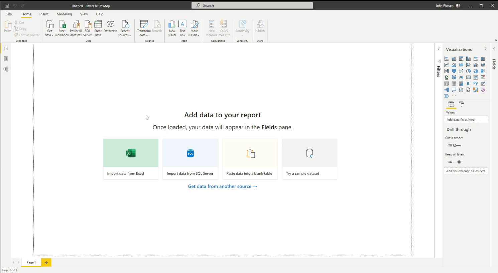
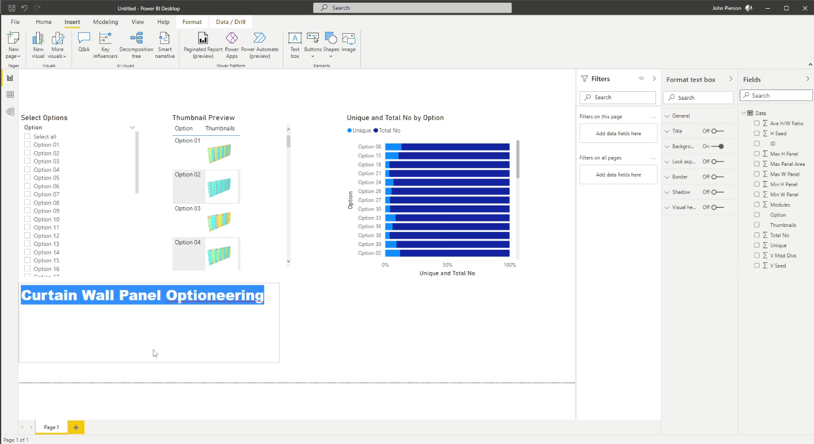

# Telling a Story with Generative Design Outcomes

  

## Description

This workflow demonstrates how to take the exported CSV from Generative Design and use it in Power BI for visualization.

With this data, we are truly able to tell a story with our Generative outcomes. 

[Download workflow files](https://github.com/DynamoDS/RefineryPrimer/releases/download/samples-v2/EXPLORE_CWOptimization.zip).

## Exporting Outcomes from Generative Design

With Generative Design v22.3.10 and up we are now able to export outcomes. This option is available in the context menu within the “explore outcomes” dialogue.

  

Upon export, your outcomes will be in a zip file.

  

Within the zip file, we now have access to all of the thumbnails created and a CSV file with the run results.

  

The CSV file has all of the run results within it. It also has some additional data on the first two rows, for this example, we are going to go ahead and clean these rows out.



## Hosting Images Externally
Before we move into the data visualization portion of this workflow, we need to load our thumbnails into the file.

First, we need to host our images somewhere public. In this case, we utilized Github, which has a free account option and publicly accessible links.

  

Second, we will link these images in Excel. There is a Dynamo graph provided in the dataset above for this.

  

## Power BI

With this data fixed we can directly import this into another tool for data visualization. A popular tool for visualizing data is PowerBI from Microsoft. In this example, we are going to use the desktop version.

  

  

  

## Video Tutorial



