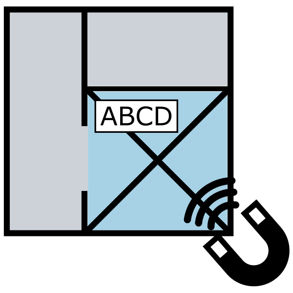

# Telling a Story with Generative Design Outcomes

  

## Description

This workflow adds additional logic to room tagging. 

In this example we account for ideal placement locations (no overlap), proximity to room center and updating of already placed tags.

[Download workflow files](https://github.com/DynamoDS/RefineryPrimer/raw/master/04-sample-workflows/4-09_optimized-room-tagging/04-09-00_Example-files/Optimized%20Room%20Tag%20Placement.zip).

## Workflow Write Up

[Optimizing Room Tag Placement with Generative Design, DynaShape and VASA](https://dynamobim.org/optimizing-room-tag-placement-with-generative-design-dynashape-and-vasa/)