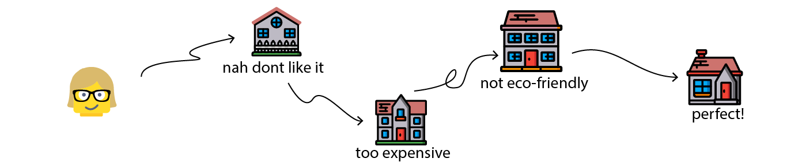

# What Can Generative Design Be Used for?

Generative design helps with common design problems that don't have a single, clear solution. As designers, we often encounter problems like this that have more than one possible solution, complex inter-dependencies, and/or contradictory requirements. 

For example, we might have a good idea of what a building needs to be properly designed, but no straightforward recipe to achieve it. This is often defined as a [wicked problem](https://en.wikipedia.org/wiki/Wicked_problem), and this is the type of problem that generative design is used for.

