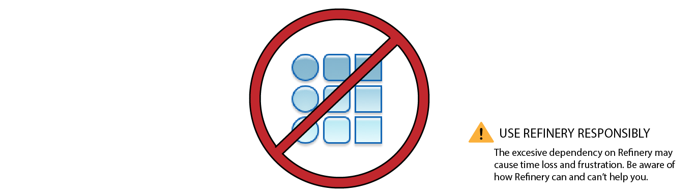
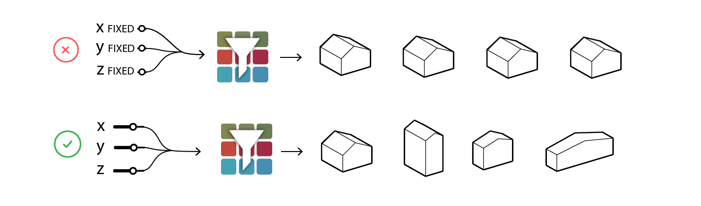
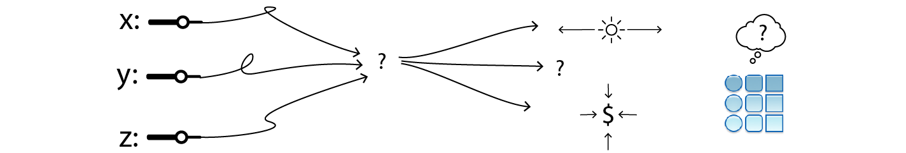

# What Can't Generative Design Be Used for?

If you want to implement Generative Design for Revit in your office, it's important to understand what it can and cannot do, and to communicate this information correctly to your team. 

Unrealistic expectations of Generative Design could cause users to become disillusioned by it and risk losing further interest in investing in generative design applications in the future.

## **Myths and Misconceptions:**

Although Generative Design is great at solving problems, there are certain problems that are not appropriate for the application. 

Guiding a team into allocating the appropriate amount of time and effort into the most relevant problems can be just as important as solving the problem itself. Some of the common mistakes are described below:

### **Obvious Solutions**

One of the advantages of Generative Design is that it can help you clarify multi-dimensionality and complexities that go way beyond human understanding. 

Although some of the examples presented in this primer are simple, the true potential of Generative Design is achieved by incorporating conflicting criteria with the right amount of complexity. To avoid wasting time - and to ensure Generative Design becomes a valuable resource - users should focus on problems that do not have obvious solutions. 

_Note: If your problem has obvious solutions then you may need more variables._

### Confusing Visual Programming Problems with Generative Design Problems

Even though Generative Design works with Dynamo, it is important to differentiate between problems that need an automated process and problems that need exploration. 

As a rule of thumb, if you intend to solve a problem that deals with automation, use Dynamo; if you intend to explore multiple solutions, use Generative Design.

### Incorrectly Defined Problems

A generative design problem always needs a set of variables or inputs. These inputs are manipulated by the user and their variation should result in a design space to explore. 

If these variables are too limited, Generative Design won't be able to offer a variety of results to the problem.

### No Clear Relationship Between Variables and Intention

Unfortunately, Generative Design cannot create design parameters for you. It would be similar to asking Google for the meaning of life. 

If you don’t have clear goals to evaluate or clear ways of defining which designs are acceptable, then Generative Design can’t help you. There should also be a clear understanding on how the intention relates to your inputs.

