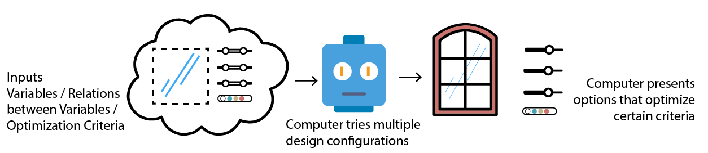

# Is Generative Design Machine Learning?

Although many people are using machine learning as an industry buzzword it is important to differentiate between the terms generative design and machine learning. So as a quick answer, NO, generative design is not machine learning. In simple terms, while machine learning is used to analyse and predict, generative design creates/generates.

## Machine Learning

## Generative Design

The diagram above shows how these terms differ in their process. You can think of machine learning as a pattern finder and generative design as a creator.

