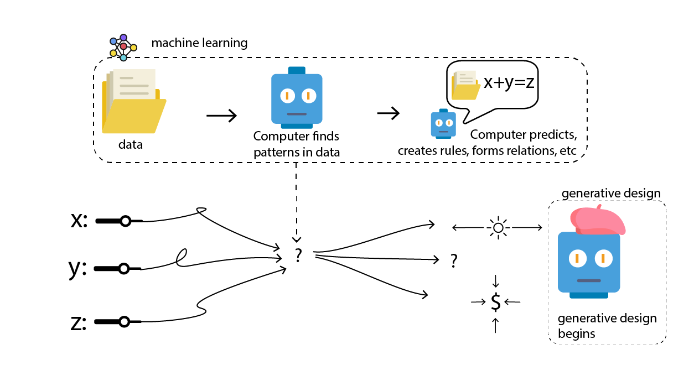

# Can Machine Learning and Generative Design Work Together?

Machine learning can be a great tool for complementing generative design when large datasets are available.

Technically, we could try to leverage ML at any stage of the generative design process, but one of the most promising applications of ML is in creating a more realistic starting condition for the generative design system. 

Often, when starting a generative design process, the computer will create a first design using random inputs or values and then further explore options and optimise them. Machine learning can very effective in creating this initial design based on accurate historical data, which the generative design process will then use to produce potentially better or more relevant designs.

Simply put, better input data should lead to better outcomes. 

