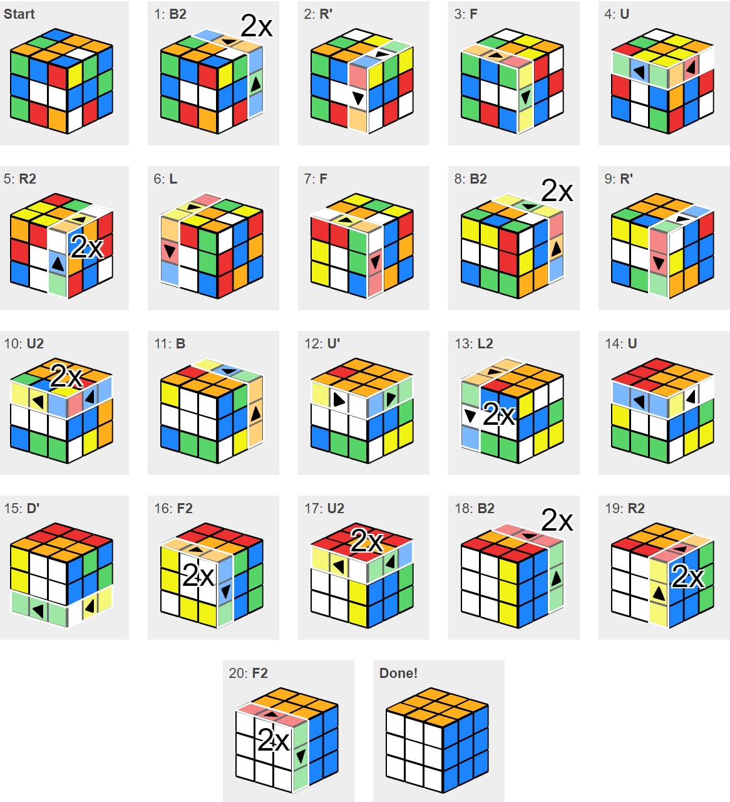

# Solvers

A solver is an algorithm specifically designed to find the solution to a precisely defined problem. If you pass the solver a problem of the right form, it will use built-in procedures to find you a solution. This means that the designer doesn’t have to do all the calculations herself. 

Think of a solver as a tool that can automate running a script that contains generators and evaluators many times. A solver can use different methods to process these scripts in different ways, for example the methods currently available in Refinery include:

* **Randomize** - when Refiery uses the Randomize option it will generate a specified number of design options, by randomly assigning a value to each of the input parameters. This option is what you would use when doing a optioneering process. For a deeper explenation of this see INSERT LINK.

* **Optimize** - is the method for doing a optimization run with Refinery. During an optimization run Refinery will evolve the design based on the evaluators outputs. For a deeper explenation of this see INSERT LINK.

* **Cross Product** - The Cross Product method let's you explore the entire design space of your design, by combining each step of every parameter with the remining parameters.

* **Like This** - Will make Refinery apply slight variations to your current input configuration. Using this method let's you explore different variations of a design that you already like.

Solvers typically require inputs to take a very specific form. Often, the greatest challenge is defining your problem in a way that a solver can understand. To take a simple example, your phone’s calculator is a solver for addition, subtraction, and division – but it only works if you punch things in correctly.

Another example of a solver is a rubiks cube solver. A rubiks cube consist of 54 colored fields that can turn in different directions, the goal is to have each side of the cube to be a specific color. Each time we twist the cube we generate a new layout, this layout can be evaluated based on how close the cube is to being covered with the right color. 

Solving a rubiks cube is normally a manual process were you turn the sides and check the new layout.

>(https://rubiks-cube-solver.com/)

If we instead of solving the rubiks cube the traditional way use a solver, we can feed the solver the rubiks cube a have that generate layouts until it reaches the correct soultion.

>The solver will run the rubiks cube automatically until it ends up with the correct result.