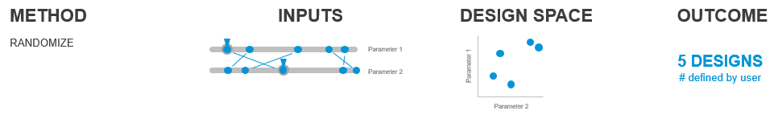
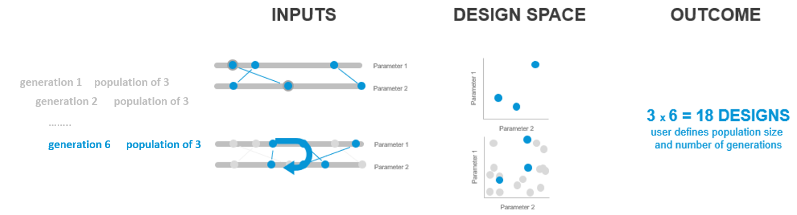
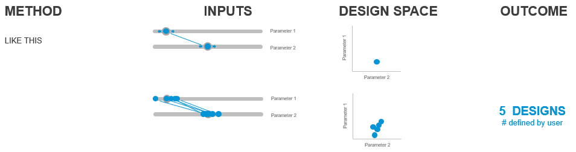

# Solvers

Think of a solver as a tool that can automate running a script that contains generators and evaluators many times.

A solver can use different methods to process these scripts in different ways, for example the methods currently available in Refinery include:

## Randomize
when Refiery uses the Randomize option it will generate a specified number of design options, by randomly assigning a value to each of the input parameters. This option is what you would use when doing a optioneering process. For a deeper explenation of this see INSERT LINK.

## Optimize
Optimize is the method for doing a optimization run with Refinery. During an optimization run Refinery will evolve the design based on the evaluators outputs. The optimization process works by running multiple generations of a design, each generation will use the input configuration from previous generations and from that optimize the new design options. For a deeper explenation of this see INSERT LINK.

## Cross Product
The Cross Product method let's you explore the entire design space of your design, by combining each step of every parameter with the remining parameters.

## Like This
Like This will make Refinery apply slight variations to your current input configuration. Using this method let's you explore different variations of a design that you already like.

Solvers typically require inputs to take a very specific form. Often, the greatest challenge is defining your problem in a way that a solver can understand. To take a simple example, your phone’s calculator is a solver for addition, subtraction, and division – but it only works if you punch things in correctly.